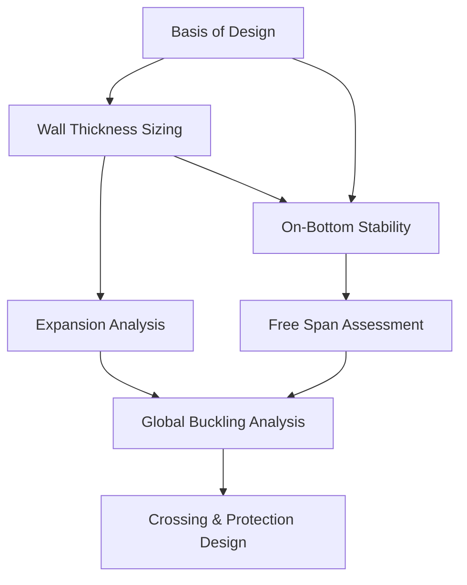

# Subsea Pipeline Engineering Data Workflow

This document outlines the data flow and interdependencies between engineering workscopes, serving as a blueprint for software development and automation in the pipeline domain.

## 1. High-Level Data Flow
The engineering process is sequential but requires cyclic validation (Feedback Loops).

## 2. Workscope Interdependencies

| Workscope | Critical Inputs from Previous Steps | Impact of Changes |
| :--- | :--- | :--- |
| **Wall Thickness** | Design Pressure (BoD), Water Depth (BoD). | Governance of pipe weight and stiffness for all following steps. |
| **Stability (OBS)** | Nominal OD/WT (Wall Thickness), Saturated Soil Density (BoD). | Determines if Concrete Weight Coating (CWC) is needed, changing OD/Weight for Expansion/Spans. |
| **Expansion** | Temperature/Pressure (BoD), Pipe Submerged Weight (OBS), Soil Friction (BoD). | Determines axial force/displacement; critical for End Termination design and Buckling. |
| **Free Span** | Seabed Profile (BoD), Concrete Coating (OBS), Flow Velocity (BoD). | High sensitivity to pipe weight; span limits can dictate trenching/rock dump requirements. |
| **Global Buckling** | Axial Force (Expansion), Pipe Stiffness (WT), Soil Resistance (BoD). | Final verification of structural integrity; may force a redesign of expansion loops or pipe weight. |

## 3. Data Entities for Software Modeling

### Project Basis
- `DesignLife`: integer (years)
- `DesignCode`: enum (DNV-ST-F101, API-1111)
- `MetoceanData`: { WaveHeight, WavePeriod, CurrentVelocity }

### Pipe Material
- `Diameter`: float (mm)
- `WT`: float (mm)
- `MaterialGrade`: string (e.g., "X65")
- `SMYS`: float (MPa)

### Calculated Results (Outputs)
- `CollapsePressure`: float (barg)
- `RequiredSubmergedWeight`: float (kg/m)
- `AllowableSpanLength`: float (m)
- `MaxEquivalentStress`: float (MPa)

## 4. Automation & API Integration Points
- **Input Validation:** Cross-check user inputs against DNV safety class requirements.
- **Reporting Engine:** Automate the population of Design Reports from calculated data entities.
- **Sensitivity Analysis:** Programmatically vary inputs (e.g., water depth, soil friction) to assess design robustness.
- **Workflow Orchestration:** Trigger downstream analysis (e.g., Spans) automatically when upstream data (e.g., Wall Thickness) changes.
