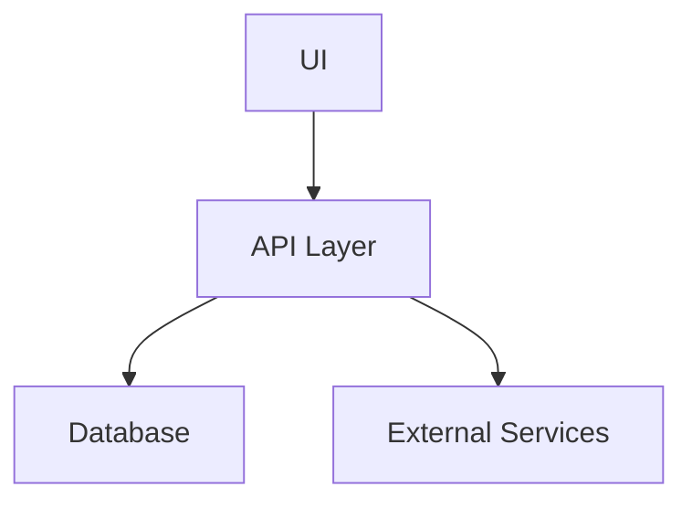

# Architecture Design Document: [Project Name]

## 1. System Overview
High-level architectural diagram (Mermaid or description).

## 2. Component Diagram

## 3. Data Schema
Describe the key data structures and database tables.

## 4. Technology Stack
- **Language**: Python / Javascript
- **Framework**: [E.g., FastAPI, React]
- **Infra**: [E.g., Docker, AWS]

## 5. Security Architecture
How is data secured in transit and at rest?
