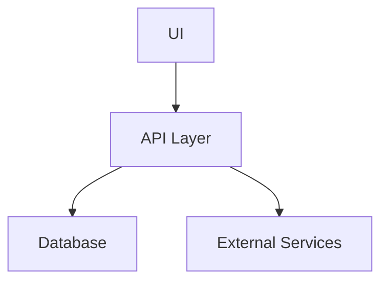

# Architecture Design Document: [Project Name]

## 1. System Overview
High-level architectural diagram (Mermaid or description).

**Capability Overview** (Inferred from `diagrams/capability.pdf_page_0.png`):
The system provides:
- **Single Pipe Configuration**: Design and configuration of individual pipe segments.
- **Cross Section Design**: Detailed visualization and modification of pipe cross-sections.
- **Wall Thickness Calculation**: Automated engineering calculations ensuring structural integrity.

## 2. Component Diagram

## 3. Data Schema
Describe the key data structures and database tables.

**Inferred Data Model** (from `diagrams/tables.pdf_page_0.png`):
The data schema includes the following core entities:
- **Pipes**: Stores unique identifiers (`pipe_id`) and general pipe properties.
- **Materials**: Defines specifications for various pipe materials.
- **Dimensions**: Manages wall thickness, diameter, and length parameters.
- **Configurations**: Saves user-defined pipe configurations and associated project metadata.

## 4. Technology Stack
- **Language**: Python / Javascript
- **Framework**: [E.g., FastAPI, React]
- **Infra**: [E.g., Docker, AWS]

## 5. Security Architecture
How is data secured in transit and at rest?
